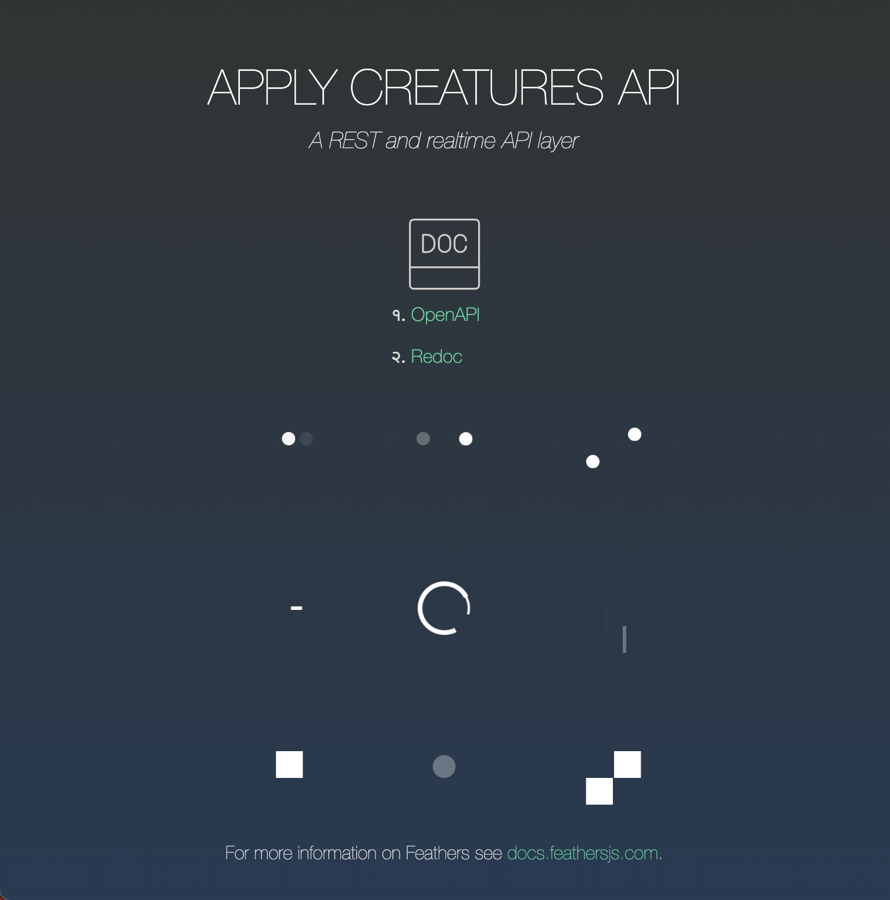

<!-- PROJECT SHIELDS -->

[![Contributors][contributors-shield]][contributors-url]
[![Forks][forks-shield]][forks-url]
[![Stargazers][stars-shield]][stars-url]
[![Issues][issues-shield]][issues-url]
[![repo-size][repo-size-shield]][repo-size-url]
[![license][license-shield]][license-url]

<!-- PROJECT LOGO -->
<br />
<div align="center">

  <h3 align="center">Creature API Boilerplate</h3>

   <a href="#">
      
   </a>

  <p align="center">
    Boilerplate for REST API components
    <br />
    <a href="#"><strong>See live (soon) »</strong></a>
    <br />
    <br />
    <a href="https://github.com/apply-creatures/creature-api-boilerplate/issues">Report Bug</a>
    ::
    <a href="https://github.com/apply-creatures/creature-api-boilerplate/issues">Request Feature</a>
  </p>
</div>

<p align="center">
OK, DOkey
</p>

<!-- TABLE OF CONTENTS -->
<details>
  <summary>Table of Contents</summary>
      <ol>
         <li>
            <a href="#about">About</a>
            <ul>
                <li>
                    <a href="#built-with">Built With</a>
                </li>
            </ul>
         </li>
         <li>
         <a href="#getting-started">Getting Started</a>
         <ul>
            <li><a href="#prerequisites">Prerequisites</a></li>
            <li><a href="#repo">Repo</a></li>
            <li><a href="#develop">Develop</a></li>
            <li><a href="#build">Build</a></li>
            <li><a href="#deploy">deploy</a></li>
         </ul>
         </li>
         <li><a href="#roadmap">Roadmap</a></li>
         <li><a href="#contributing">Contributing</a></li>
         <li><a href="#license">License</a></li>
         <li><a href="#acknowledgments">Acknowledgments</a></li>
      </ol>
</details>

<hr/>

**TL;DR** - skip to [getting-started](#getting-started)


<hr/>

<!-- ABOUT THE PROJECT -->

## About

Setting up an API server is a daunting exercise with authorization, doc generated from source, helmets and other safe props.
So I created a template, that way one can kick things off almost right away.

<div align="center">
   <a href="#">
      
   </a>
</div>

## Features

* REST APIs
* Authentication
* OpenAPI Doc generation and Swagger UI
* RedDoc generation from API specs
* Postgres integration
* (some) unit tests

Of course, nothing is perfect, but I will try to keep this up to date and fix issues right here. If I failed in accomplishing that, shoot me a message.
If you've truly tried everything and still can't get this to work for you, try to reach out. Or raise an issue. But I make no promise

<p align="right">(<a href="#readme-top">back to top</a>)</p>

### Built With

- [node.js](https://nodejs.org/) - of course
- [feathersjs](https://feathersjs.com/) - never did before, I almost used another one, but it seems solid
- [sequelize](https://sequelize.org/) - because it simplifies interfacing with a DB, and abstracts which kind of DB that is
- [winston](https://github.com/winstonjs/winston) - for better logging

### Also using

- [OpenAPI](https://www.openapis.org/) - To nicely document the API interfaces
- [Redoc](https://github.com/Redocly/redoc) - Because it reads more like real documentation  
- [biome](https://biomejs.dev/linter/) - that keeps my code well formatted

<hr/>

<!-- GETTING STARTED -->

## Getting Started

### Prerequisites

- you need [Git](https://git-scm.com/) installed
- and [nodejs](https://nodejs.org/) of course
- [postgres](https://www.postgresql.org/) installed

### Set up repo

```bash
$ git clone https://github.com/apply-creatures/creature-api-boilerplate.git
```

Navigate to the repo root's folder & install dependencies

```bash
$ cd ./creature-api-boilerplate && npm install
```

### Develop

**Start postgres**

you may also want to create the database or the server may crash at startup 

```sh
psql -U postgres -h localhost
CREATE DATABASE creature_api_boilerplate;
```

**Launch in develop mode**

```bash
$ npm run develop # code changes will automatically reload the server
```

**Access via browser**

- Hit [http://localhost:3030](http://localhost:3030)

### Build

This command will compile for production deployment:

```bash
$ npm run compile
```

It generates the files as js for node to execute directly, yeah Nodejs doesn't understand Typescript.

Then you can:

```sh
npm run start:prod
```

But if you are truely in production as this point you may need to check the Docker container [file](./Dockerfile) and the compose [here](./docker-compose.yml) which would spin up a postgres and the server. 

### Deploy

To host the server, better use a container. Or you may try that but check what it's doing first.

```bash
$ npm run deploy
```

_you should really look at the scripts in [package.json](./package.json), search for "scripts".

<p align="right">(<a href="#readme-top">back to top</a>)</p>

### Adding an endpoint

An endpoint is a service.

- Look at an exiting hook in the [services](./src/services/) folder 
- Create your own service, or add a function to an existing one
- Make sure to document your endpoint via swagger annotation
- Verify it works and that the doc and schema's alright

### Adding a model

You may want to store stuff in a DB. for that create a model for your entities.
If you spread direct connections in your service, it will be hard to keep things DRY. And, you may seriously sabotage potential desires to switch to another type of DB down the road. And you will ending writing more code than you need to. Instead:

- Look at an existing model in the [models](./src/models/) folder
- Figure it out

<hr/>

## Roadmap

- [x] Setup a repo with an API framework -> feathersjs
- [x] Setup all the whistle, helmet with headers, CORS, serving static welcome page, logger
- [x] Add a bit of midlayer, some endpoint with some models
- [x] Sequelize to hook this up to a DB (mostly for auth)
- [x] Setup auth, username/password and JWT, dahell with social
= [x] Swagger - I think that's done, maybe more spec propoerties but that's enough
- [x] Fix auth - creating users with encrypted password works, but for some reason logging in with password does not work
- [x] ReDoc from swagger spec
- [x] Serve some static landing page with links to docs
- [x] Some env variable for DB settings
- [ ] More testing
- [ ] More I guess

<hr/>

## Contributing

Contributions are what make the open source community such an amazing place to learn, inspire, and create. Any contributions you make are **greatly appreciated**.

If you have a suggestion that would make this better, please fork the repo and create a pull request. You can also simply open an issue with the tag "enhancement".
Don't forget to give the project a star! Thanks again!

1. fork the Project
2. create your Feature Branch (`git checkout -b feature/some-feature`)
3. commit your Changes (`git commit -m 'Add some feature'`)
4. push to the Branch (`git push origin feature/some-feature`)
5. open a Pull Request

<hr/>

<p align="right">(<a href="#readme-top">back to top</a>)</p>

<hr/>

## Acknowledgments

It would never end. I've done this work not just off dozens of other people's open source work, but hundreds thousands or maybe millions.
Special kudo to the gatsby team that made such an easy tool to build static websites, the pipeline and community is awesome.

Whoever made markdown, although that was probably inspired by some other cool markups languages, thank you.

the js community, millions of developers made the npm ecosystem so rich one can build virtually anything with node.

If you decide to re-use this repo to build your own stuff, go ahead. No need to credit or link back to this repo/site. Although it would be appreciated.
**Don't re-republish stuff pretty much as is though**, it is lame, and shameless.
Tweak it, make it your own. Make it so that I wouldn't come across your stuff  and think that it is mine. So that nobody comes across your stuff and somehow finds out it's a louzy copy of someone else lacking added value and personalisation.

[contributors-shield]: https://img.shields.io/github/contributors/apply-creatures/creature-api-boilerplate.svg?style=for-the-badge
[contributors-url]: https://github.com/apply-creatures/creature-api-boilerplate/graphs/contributors
[forks-shield]: https://img.shields.io/github/forks/apply-creatures/creature-api-boilerplate.svg?style=for-the-badge
[forks-url]: https://github.com/apply-creatures/creature-api-boilerplate/network/members
[stars-shield]: https://img.shields.io/github/stars/apply-creatures/creature-api-boilerplate.svg?style=for-the-badge
[stars-url]: https://github.com/apply-creatures/creature-api-boilerplate/stargazers
[issues-shield]: https://img.shields.io/github/issues/apply-creatures/creature-api-boilerplate.svg?style=for-the-badge
[issues-url]: https://github.com/apply-creatures/creature-api-boilerplate/issues
[license-shield]: https://img.shields.io/github/license/apply-creatures/creature-api-boilerplate.svg?style=for-the-badge
[license-url]: https://github.com/apply-creatures/creature-api-boilerplate/blob/main/LICENSE
[score-shield]: https://img.shields.io/ossf-scorecard/github.com/apply-creatures/creature-api-boilerplate?style=for-the-badge
[score-url]: https://github.com/apply-creatures/creature-api-boilerplate
[repo-size-shield]: https://img.shields.io/github/repo-size/apply-creatures/creature-api-boilerplate?style=for-the-badge
[repo-size-url]: https://github.com/apply-creatures/creature-api-boilerplate/archive/refs/heads/main.zip
[product-screenshot]: images/apply-creatures-logo.png

## Changelog

Changelog see [here](CHANGELOG.md)

## License

[![license][license-shield]][license-url]

This work is licensed under the [MIT License][license-url].

You may use and remix this content, and even build commercial stuff with it.

[license-url]: https://mit-license.org/
[cc-by-nc-sa-shield]: hhttps://img.shields.io/github/license/apply-creatures/ceature-api-boilerplate?style=for-the-badge

If you too produce work and publish it out there, it's clearer to choose a [license](https://choosealicense.com).


```markdown
MIT License

Copyright (c) 2024 Hirako, Apply Creatures

Permission is hereby granted, free of charge, to any person obtaining a copy
of this software and associated documentation files (the "Software"), to deal
in the Software without restriction, including without limitation the rights
to use, copy, modify, merge, publish, distribute, sublicense, and/or sell
copies of the Software, and to permit persons to whom the Software is
furnished to do so, subject to the following conditions:

The above copyright notice and this permission notice shall be included in all
copies or substantial portions of the Software.

THE SOFTWARE IS PROVIDED "AS IS", WITHOUT WARRANTY OF ANY KIND, EXPRESS OR
IMPLIED, INCLUDING BUT NOT LIMITED TO THE WARRANTIES OF MERCHANTABILITY,
FITNESS FOR A PARTICULAR PURPOSE AND NONINFRINGEMENT. IN NO EVENT SHALL THE
AUTHORS OR COPYRIGHT HOLDERS BE LIABLE FOR ANY CLAIM, DAMAGES OR OTHER
LIABILITY, WHETHER IN AN ACTION OF CONTRACT, TORT OR OTHERWISE, ARISING FROM,
OUT OF OR IN CONNECTION WITH THE SOFTWARE OR THE USE OR OTHER DEALINGS IN THE
SOFTWARE.
```
